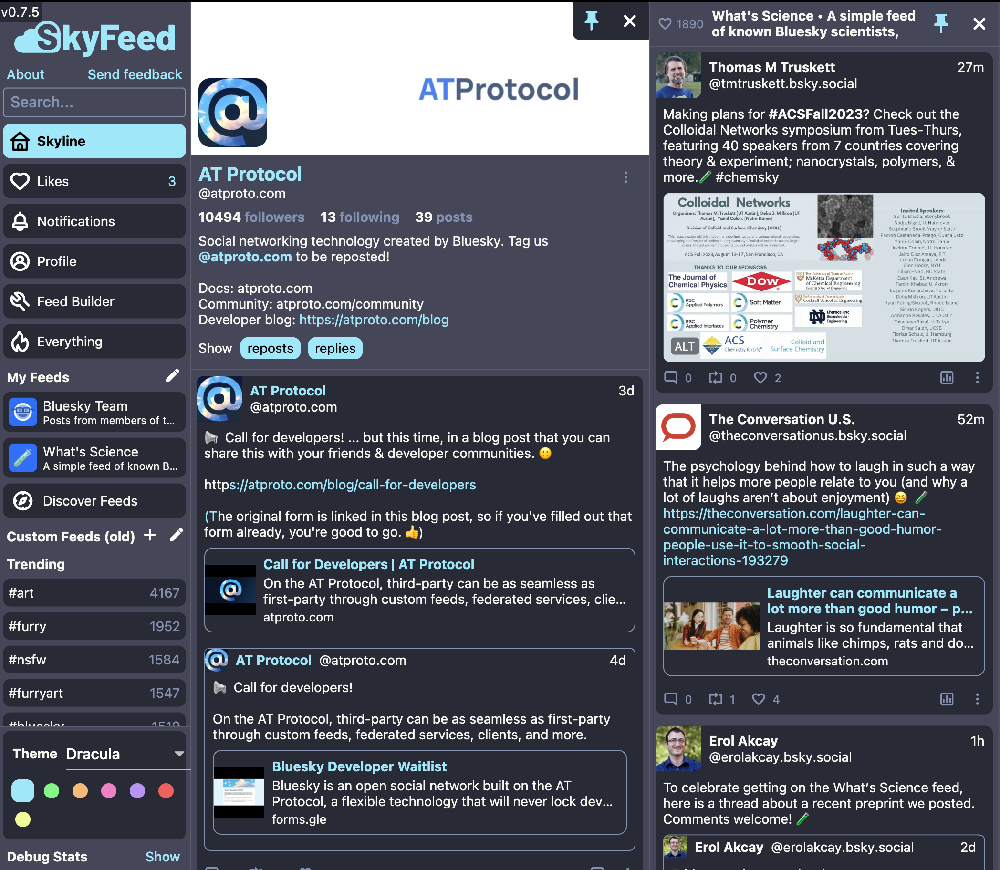
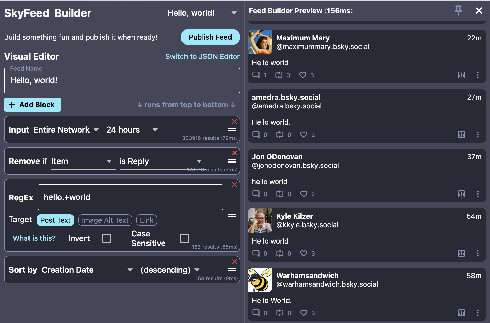

SkyFeed is a third-party client built by [redsolver](https://bsky.app/profile/redsolver.dev). Users can create a dashboard out of their feeds, profiles, and more. Additionally, while custom feeds currently take some developer familiarity to build from scratch, SkyFeed allows Bluesky users to easily build their own custom feeds based off of regexes or lists.

You can try SkyFeed yourself [here](https://skyfeed.app/), and follow [SkyFeed’s Bluesky account](https://bsky.app/profile/skyfeed.app) for updates.

---

### Can you share a bit about yourself and your background?

Hi, I’m [redsolver](https://bsky.app/profile/redsolver.dev), a developer from Germany. [In the past I tried building a decentralized social network](https://blog.sia.tech/building-skyfeed-our-hackathon-experience-be605409f684) twice, but both times it failed, most recently due to the decentralized storage layer (Skynet) just shutting down completely. So last year I started working on a [new content-addressed storage network](https://docs.sfive.net/) myself with all features needed for a truly reliable social network. I'm still actively working and building open-source apps like an [end-to-end-encrypted cloud storage app](https://vup.app/) on top of it, but instead of building yet another social network from scratch, I decided to focus on building cool stuff for atproto/Bluesky. The AT Protocol shares many ideas with my previous attempts (like decentralized identity) and is already a lot more mature.

### What is SkyFeed?

There's the SkyFeed app, which is a **third-party web client (cross-platform soon) for using Bluesky**. Some users compare the experience to TweetDeck. A unique feature is that it subscribes to a custom minimal version of the Bluesky firehose (all events happening on the network). This makes it possible to have all like/reply/repost counts update in real-time and new posts pop up in near real-time everywhere in the app! Another cool feature is the collapsible thread view which makes following big discussions a lot easier.

But most users are using the app because of the integrated **SkyFeed Builder**, a tool to make building feeds easier for both developers and non-developers. It's really exciting watching a very diverse set of users build the over 6,000 feeds that are already published using the builder! The SkyFeed web app is available at[ https://skyfeed.app/](https://skyfeed.app/).

### What inspired you to build SkyFeed?

As mentioned earlier, I've been really interested in decentralized social networks for a while. After getting a Bluesky invite and reading the atproto docs, the tech really caught my interest.

There were already quite a few third-party clients, but none of them were written in Flutter (my favorite framework). So I started working on a new one, both for getting a better feel of the Bluesky internals and because I wanted a desktop client that I personally enjoy using daily. Even though the first release was missing quite a lot of important features (like notifications), the positive feedback motivated me to continue building.

When the Bluesky team published the custom feed spec and [the feed generator starter kit](https://github.com/bluesky-social/feed-generator), things really took off. I made some feeds and added experimental support for using them to the SkyFeed app. They are an awesome concept and in my opinion really give Bluesky the edge over competing networks. It makes content discovery so much easier, because no algorithm or AI has more relevant suggestions than highly engaged users building elaborate feeds for any and all niche interests they have. So the reason I made the SkyFeed Builder was to give this power to as many people as possible. And what inspires me to continue building and improving SkyFeed is all the positive feedback and happy users :)

### What tech stack is SkyFeed built on?

The SkyFeed app is built using the [Flutter framework](https://flutter.dev/) and the [Dart programming language](https://dart.dev/). I'm using the excellent [Dart atproto/Bluesky packages](https://pub.dev/publishers/atprotodart.com/packages), created by [Shinya Kato](https://bsky.app/profile/shinyakato.dev). Most of the backend is written in Dart and running on some Hetzner servers, the feed generator proxy and cache were recently moved to fly.io for better scalability. I'm running multiple [open-source indexers](https://github.com/skyfeed-dev/indexer) which listen to the entire network firehose and store everything in an instance of [SurrealDB](https://surrealdb.com/). SurrealDB is still in beta, but it's fun to work with! And apart from some performance issues, it has been pretty reliable. The query engine for the SkyFeed Builder feeds is written in Rust and[ open-source](https://github.com/skyfeed-dev/query-engine) too. It keeps all posts from the last 7 days and their metadata in memory and then executes all of the SkyFeed Builder steps/blocks. Additional metadata (like the full post history for a single user) are fetched on demand from SurrealDB.

### What's in the future for SkyFeed?

* New "Remix" feature to edit, improve and re-publish any SkyFeed Builder feed (as long as it has an open license)
* Make it easier to self-host the SkyFeed Builder infrastructure and get some third-party providers online. This will give users more choice and make the whole feed ecosystem more reliable and robust
* Add support for personalized feeds and SurrealQL queries to the builder, but they are very resource-intensive so will likely be invite-only (but self-hosting always works of course!)
* Improve the SkyFeed app, get a nice new logo, fully open-source it and release cross-platform (Android, iOS, Linux, Windows, macOS)
* Support for videos, audio and other media content with a new custom lexicon in a backwards-compatible way. They will use the storage network I'm working on, but with an atproto-compatible blob format. The main difference is that it uses the BLAKE3 hash function instead of SHA256 and has no file size limit
* A self-hosted proxy which bridges other social networks (Mastodon, Nostr, RSS, Hacker News) and makes them available in any Bluesky client. Reddit and "X" might be supported too, but with a bring-your-own-API-key requirement. The proxy also adds more features like advanced (word) muting, an audit log to see exactly which changes third-party apps made to your account and the option to use a self-hosted "App View" (basically the SkyFeed Indexer with SurrealDB)
* A new List Builder (based on profile, name, follower count and more) as soon as lists other than Mute Lists are supported

In summary: Make SkyFeed (apps, builder and more) the ultimate power user experience, while open-sourcing everything and keeping the option to self-host all components.

---

You can follow redsolver on Bluesky [here](https://bsky.app/profile/redsolver.dev), SkyFeed for project updates [here](https://bsky.app/profile/skyfeed.app), and be sure to try out SkyFeed yourself [here](https://skyfeed.app/).

*Note: Use an [App Password](https://atproto.com/community/projects#app-passwords) when logging in to third-party tools for account security and read our [disclaimer](https://atproto.com/community/projects#disclaimer) for third-party applications.*
