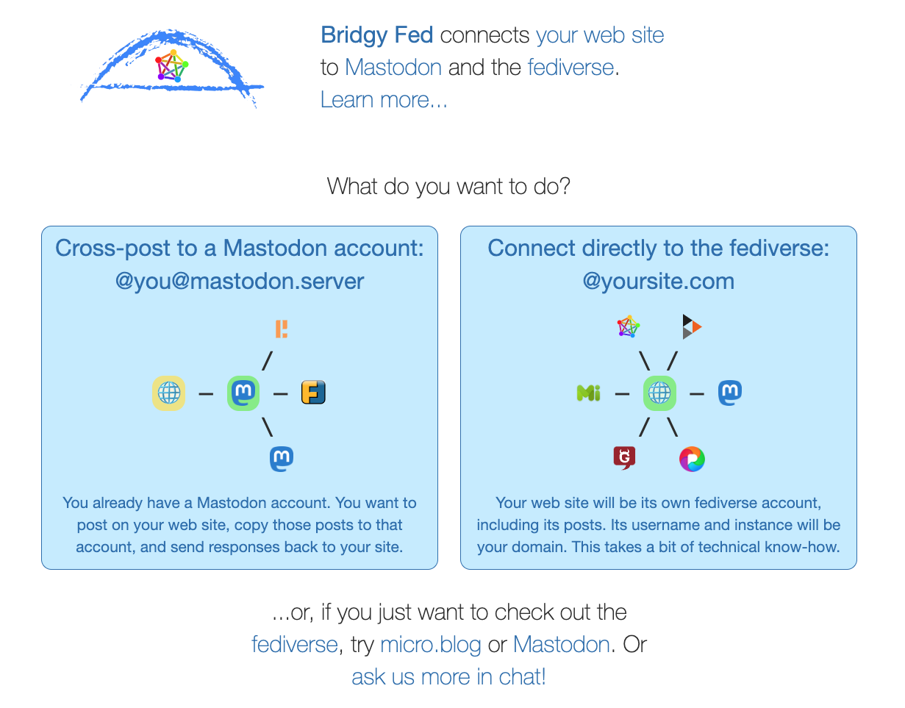

[Bridgy Fed](https://fed.brid.gy/) is a bridge between decentralized social networks that currently supports the IndieWeb and the [Fediverse](https://opensource.com/article/23/3/tour-the-fediverse), a portmanteau of “federated” and “universe” that refers to a collection of networks including Mastodon. It's a work-in-progress by [Ryan Barrett](https://snarfed.org/) ([@snarfed.org](https://bsky.app/profile/did:plc:fdme4gb7mu7zrie7peay7tst)), who has already added initial Bluesky support, and is planning on launching it publicly once Bluesky launches federation [early next year](https://atproto.com/blog/2023-protocol-roadmap).

Bridgy Fed is [open source](https://github.com/snarfed/bridgy-fed), and Ryan has a guide on [how IDs and handles are translated between networks](https://fed.brid.gy/docs#translate). He welcomes feedback!

---

### Can you share a bit about yourself and your background?

I'm a dad, San Francisco resident, and [stereotypical Silicon Valley engineer](https://snarfed.org/resume) who's always been interested in owning his presence online.

### What is Bridgy Fed?

[Bridgy Fed](https://fed.brid.gy/) is a bridge between decentralized social networks. It currently supports the IndieWeb and the Fediverse, and I soon plan to add other protocols like Bluesky and Nostr.

It's fully bidirectional; from any supported network, you can follow anyone on any other network, see their posts, reply or like or repost them, and those interactions flow across to their network and vice versa. [More details here.](https://snarfed.org/2023-11-27_re-introducing-bridgy-fed)

[Initial Bluesky support is complete!](https://snarfed.org/2023-11-15_bridgy-fed-status-update-9) All interactions are working, in both directions. I'm looking forward to launching it publicly after Bluesky federation itself launches!

### What inspired you to build Bridgy Fed?

The very first time I posted on Facebook, back over 20 years ago when it was just for college students, I immediately understood that I didn't control or own that space. I had no guarantees as to whether my profile and posts would stay there, who'd see them, etc. I started posting to my website/blog first, and only afterward copied those posts to social networks like Facebook.

I've been working on this stuff ever since, including tools like [Granary](https://granary.io/) and [Bridgy classic](https://brid.gy/) and the [IndieWeb](https://indieweb.org/) community, historical decentralized social protocols like OpenSocial and OStatus, and most recently [ActivityPub](https://www.w3.org/TR/activitypub/) and Bluesky’s [AT Protocol](https://atproto.com/).

### What tech stack is Bridgy Fed built on?

Bridgy Fed runs on [Google's App Engine](https://cloud.google.com/appengine/) serverless platform. It's written in Python, uses libraries like [Granary](https://granary.io/), and leverages standards like [webmention](https://webmention.net/) and [microformats2](https://microformats.org/wiki/microformats2) in addition to ActivityPub and atproto. I'd eventually like to migrate it to asyncio, but otherwise its stack is serving it well.

### What's in the future for Bridgy Fed?

I can't wait to launch Bluesky support! Nostr too. I'm also looking forward to extending the current IndieWeb support to any web site, using standard metadata like OGP and RSS and Atom feeds.

---

You can follow Ryan on Bluesky [here](https://bsky.app/profile/did:plc:fdme4gb7mu7zrie7peay7tst), find the Bridgy Fed GitHub repo [here](https://github.com/snarfed/bridgy-fed), and keep an eye out for [Bridgy Fed’s](https://fed.brid.gy/) launch next year!

*Note: Use an [App Password](https://atproto.com/community/projects#app-passwords) when logging in to third-party tools for account security and read our [disclaimer](https://atproto.com/community/projects#disclaimer) for third-party applications.*
